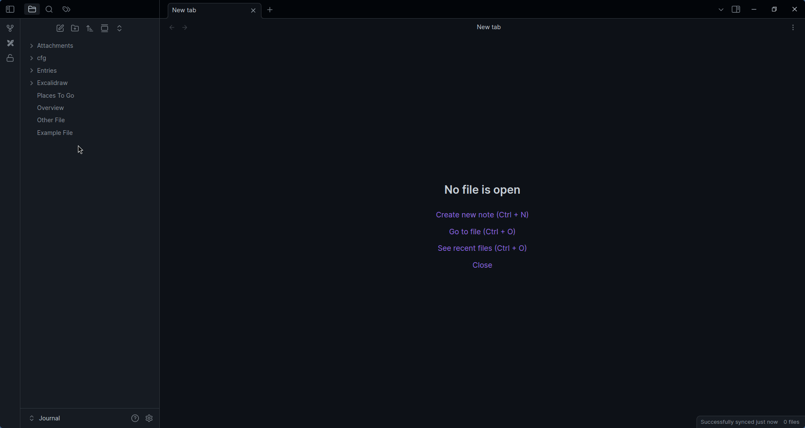

# Layout Manager

Set your [Obsidian](https://obsidian.md) layout given a file context

> [!NOTE] What is a layout?
> This project uses ther term 'layout' to describe the positions, sizes, groupping & file view mode of tabs in the main view.

## Features

- Automatic layout application when opening a file
- Preserves:
	- splits, split direction & split ratios\*
	- file groupings
	- editor mode (read only, source, live preview)
	- tab order\*
	- non-file views (eg. graph view)
- Restrict certain layouts to certain platforms
- Glob file matching
- Adhoc loading of a layout

> [!WARNING] Restrictions
> Due to the *file context based* nature of this plugin, a layout can only have 1 file.
>
> Mobile re-organizes splits to be tabs, can't do anything about that :/

## Who is this for/use cases

1. Having live preview on mobile, but having edit/preview setup on desktop
2. Having a home page that is readonly
3. Having 'edit only' files - think templater template files

## How is it different from Workspaces?

Workspaces don't offer a contextual layout feature, but rather a static 'this is the file that is open' type of thing

## How to use, how it works, etc

### Creating a layout

1. Open a file (preferably one that isn't managed)
2. Create the layout you want - splits, tabs, editor mode, etc. Make sure it is only 1 file that is open
3. Run the command `Layout Manager: Save Layout` (or if you wish to override an existing layout, `Layout Manager: Override Layout`)
4. Set the needed globs, platform etc
5. Save the layout

### Using a layout

Simply open a file that is covered by a glob pattern. This will trigger that layout

You can also open any saved layout by running `Layout Manger: Load Adhoc Layout`, then selecting a layout

## Contributing

I'm open to issues, PRs, etc!
