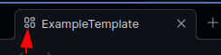

# Layout Manager

Set your [Obsidian](https://obsidian.md) layout given a file context

> [!NOTE]
> This project uses ther term 'layout' to describe the positions, sizes, groupping & file view mode of tabs in the main view.

## Features

- Automatic layout application when opening a file
- Preserves:
	- splits, split direction & split ratios\*
	- file groupings
	- editor mode (read only, source, live preview)
	- tab order\*
	- non-file views (eg. graph view)
- Restrict certain layouts to certain platforms
- Glob file matching
- Adhoc loading of a layout

> [!WARNING]
> Due to the *file context based* nature of this plugin, a layout can only have 1 file.
>
> Mobile re-organizes splits to be tabs, can't do anything about that :/

## Who is this for/use cases

1. Having live preview on mobile, but having edit/preview setup on desktop
2. Having a home page that is readonly
3. Having 'edit only' files - think templater template files

## How is it different from Workspaces?

Workspaces don't offer a contextual layout feature, but rather a static 'this is the file that is open' type of thing

## How to use, how it works, etc

### Creating a layout

1. Open a file
2. Create the layout you want - splits, tabs, editor mode, non-markdown-file views etc. Make sure it is only 1 markdown file that is open
3. Run the command `Layout Manager: Save Layout` (or if you wish to override an existing layout, `Layout Manager: Override Layout`)
4. In the modal, select the needed options
	 - [How to use glob patterns](https://www.malikbrowne.com/blog/a-beginners-guide-glob-patterns/)
5. Click the save button

### Using a layout

Simply open a file that is covered by a glob pattern. This will trigger that layout

You can also open any saved layout by running `Layout Manger: Load Adhoc Layout`, then selecting a layout

### Opening another markdown file in an existing layout

If you have a layout that is active, you can still open another markdown file (without triggering the layout for that file). Simply open it in a new tab, while the layout "has integrity".

You should be able to tell if the layout integrity is intact by seeing the icon of the tab(s) that are part of the layout. The below image is an example of a tab that has layout integrity

If you do not see an icon (and the option to enable icons is enabled), then the layout integrity is broken & opening a new file, even in a new tab, will trigger the appropriate layout.

Layout Integrity is kept for as long as all tabs that were opened as part of the layout as open & contain the same view as is in the layout. So closing a tab or changing the file that opened in the tab breaks layout integrity.

## Contributing

I'm open to issues, PRs, etc!
